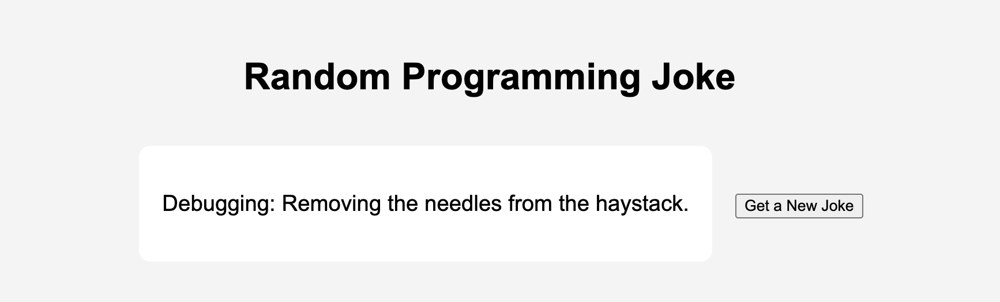

# Programming Jokes

 React application built with Vite demonstrating side-effect management using the `useEffect` hook.

---

## Table of Contents

- [Demo](#demo)
- [Features](#features)  
- [Prerequisites](#prerequisites)  
- [Installation](#installation)  
- [Testing](#testing) 

---

## Demo

## Features

- Fetches a random programming joke from [JokeAPI](https://v2.jokeapi.dev/) on page load  
- Displays a loading indicator while fetching  
- Graceful error handling with user-friendly messages  
- Button to fetch a new joke on demand  
- Built with React and Vite 

---

## Prerequisites

- **Node.js** v14 or higher  
- **npm** 

---

## Installation

1. Clone the repo
2. `npm install`
3. `npm run dev` 
4. Follow link to view site

---
## Testing
 run `npm test`